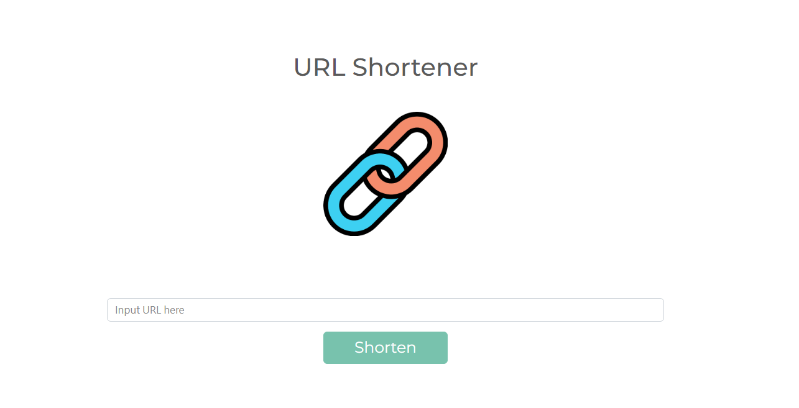
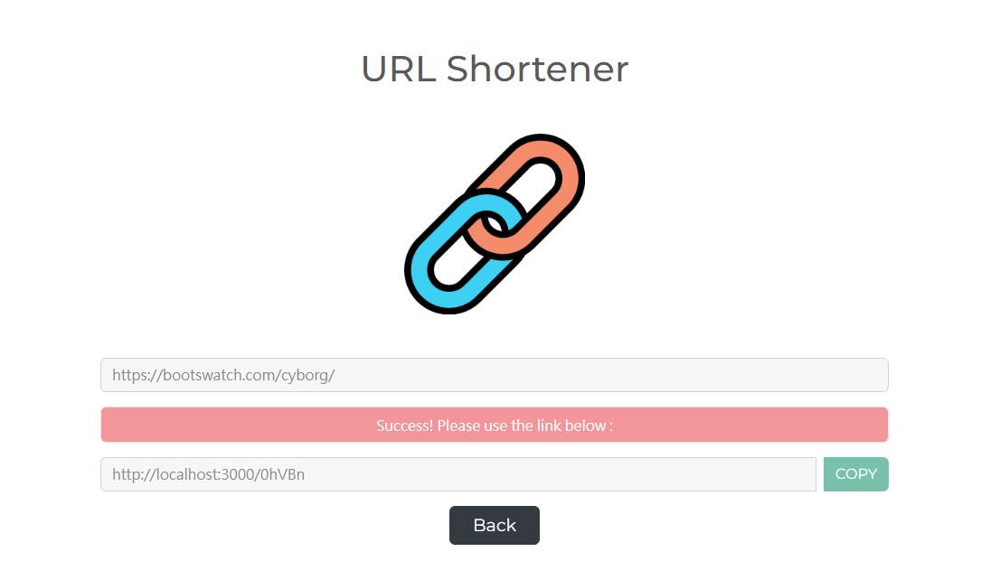

# URL Shortener - introduction

可以縮短網址長度

首頁圖


成功縮短網址圖


## 功能列表

- 可將網址縮短

### 安裝與執行步驟

1. 請先確認有安裝 node.js 與 npm
2. 將專案 clone 到本地
3. 環境變數設置: 
   * Windows cmd： set "MONGODB_PATH=你的MongoDB連線字串"
   * MacOS terminal and git bash :  export MONGODB_PATH="你的MongoDB連線字串"
4. 在本地開啟之後，透過終端機進入資料夾，輸入：

   ```
   npm install  //安裝套件
   ```

5. 安裝完畢後，繼續輸入：

   ```
   npm run start  //執行程式
   ```

6. 若看見此行訊息則代表順利運行，打開瀏覽器進入到以下網址

   ```
   Listening on http://localhost:3000
   ```

7. 結束使用

   ```
   ctrl + c  //結束程式
   ```

### 開發工具

- [Visual Studio Code](https://visualstudio.microsoft.com/zh-hant/) 
- [Node.js](https://nodejs.org/en/)
- [Express 4.16.4](https://www.npmjs.com/package/express) -
- [Express-Handlebars 3.0.0](https://www.npmjs.com/package/express-handlebars)
- [bootswatch](https://bootswatch.com/)
- [MongoDB](https://www.mongodb.com/try/download/community2)
- [Mongoose 5.9.7](https://www.npmjs.com/package/mongoose)